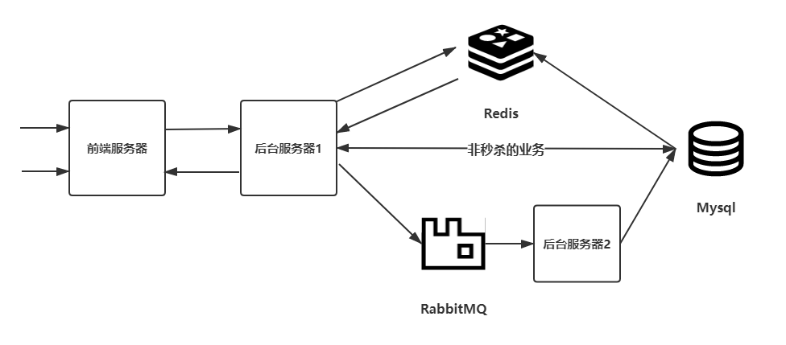
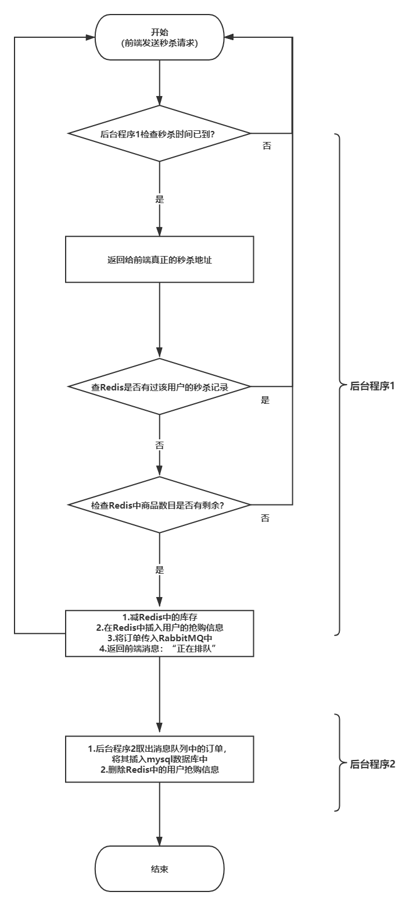
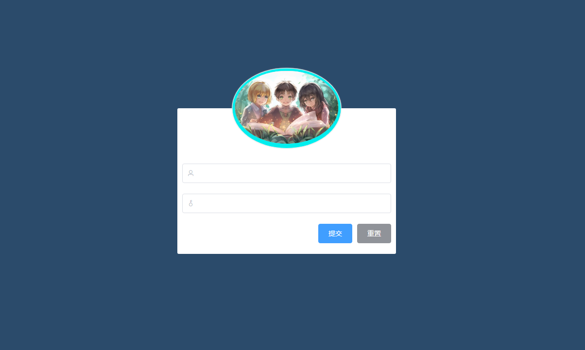
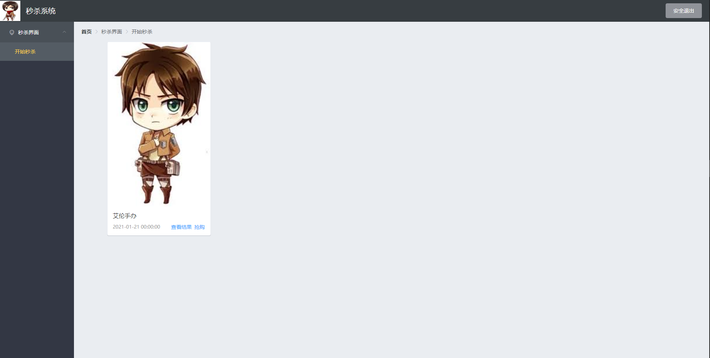
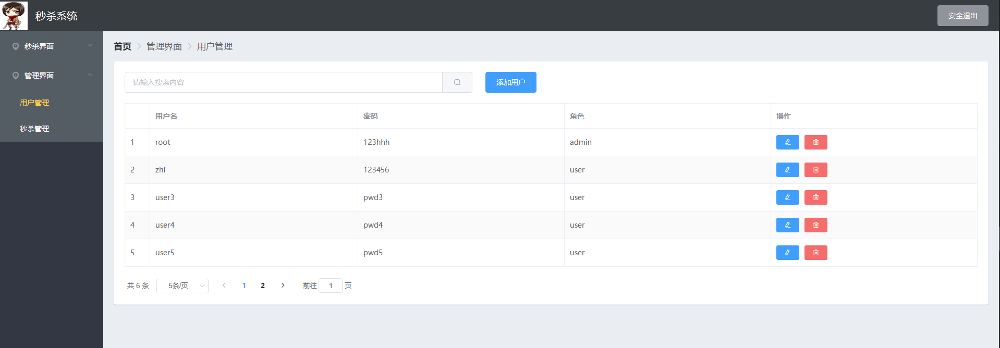
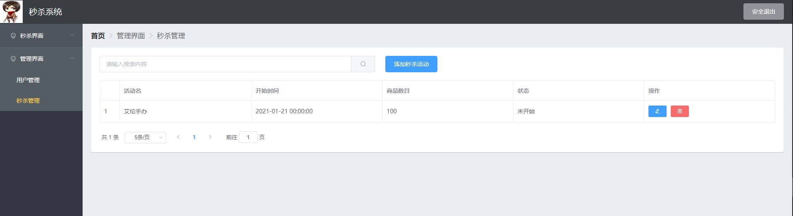

## 项目概述

项目主要采用了以下技术：

前端：`@vue/cli-4.5.9` + `Element UI` + `axios`

后端：`Springboot-2.4.0` + `MyBatis` + `RabbitMQ-3.8.9` + `Redis-6.0.9` + `Mysql-5.7.2`

其中`RabbitMQ`和`Redis`选择的是`docker`容器版本。

项目文件如下：

```
seckill
  |
  |----img #README.md所用图片
  |
  |----seckill_frontend #前端项目
  |
  |----seckill_backend1 #后台服务代码1
  |
  |----seckill_backend2 #后台服务代码2
```


整个项目架构如下图：



​	以秒杀功能为例，该功能的流程图为：



## 效果截图：

​	本项目中主要有两个功能：秒杀和用户及秒杀的管理功能。

​	本项目中用户分为两种：普通用户和管理员用户，其中普通用户只能参与秒杀活动，管理员用户可以编辑管理用户和秒杀活动。

​	登录界面：



​	下面是**普通用户**进入后看到的页面：



​	普通用户只能进行秒杀操作

​	下面是**管理员用户**进入后看到的页面：





​	

## 性能优化策略

​	性能优化的对应策略如上图架构图所示，为了能够应对秒杀带来的高并发流量，主要做了以下工作：

​	**1.接口限流：**

- 用户在秒杀按钮点击以后发起请求，在请求处理结果出来之前不能再点击秒杀按钮

- 我们在查询Redis时会判断用户是否有抢购记录，这样能够防止用户利用爬虫等方法重复请求

  **2.数据库优化：**

- 在秒杀请求中我们先使用Redis数据库，在内存上做操作提高并发量。在秒杀时大部分请求都先需要后台查询库存,这是一个频繁读的场景。我们可以使用redis来预减库存，在秒杀开始前可以在redis设值。具体地，在管理员添加一个新的秒杀活动后，程序会在redis数据库中提前设置好对应商品的数目。

- 项目中使用乐观锁来更新库存，从而解决超卖问题

  **3.异步下单：**
  
- 采用RabbitMQ，在后台经过了限流、库存校验之后，流入到这一步骤的就是有效请求。 我们将生成的订单发送到队列里，队列接受消息，异步下单。

- 后台程序2置换会从消息队列中取出消息，最终将其写入Mysql数据库

​	（其他优化点）本来真正的秒杀业务代码应该在另一台服务器上的，这样就能完全利用另一台服务器的性能，实际做项目的时候时间有点来不及就把实际秒杀服务和其他业务代码写在一起了


## 应用安全策略

### 1.管理端安全

1.用户分为普通用户和管理员用户，在登录时根据不同角色返回不同的菜单界面，从而防止普通用户越权操作

2.前端使用了`Vue`的路由守卫来保证页面之间跳转的限制，只有登录后才能访问秒杀页面

3.（待优化的）为了防止用户利用爬虫伪造身份，前端与后台交互时需要带上Token，后台代码执行业务代码之前总是会计算Token是否正确，由于时间关系这部分只写了一点

### 2.秒杀活动安全

1.为了防止用户提前拿到秒杀地址，我们有两个安全措施：

- 秒杀活动开始前不会返回真实的秒杀地址
- 秒杀活动开始后才会返回真实的秒杀地址（这里本来真实的url要配合加密MD5使用，但由于时间关系项目实现时只是返回了另一个地址）

2.为了防止同一个用户的多次请求：

- 我们首先在前端限制只能点击一次”抢购“按钮
- 在实际到达后台时，我们还会检查redis中是否有该用户的抢购记录，如果有则直接返回，防止用户利用爬虫来抢购


